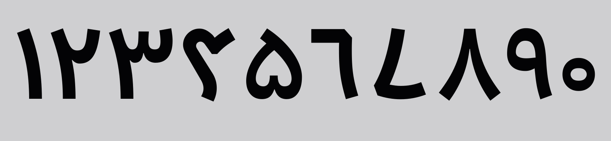
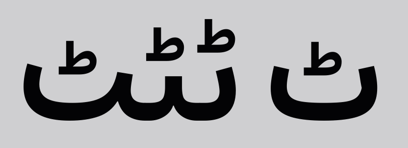
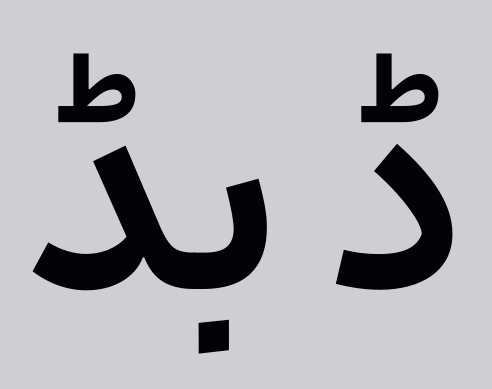
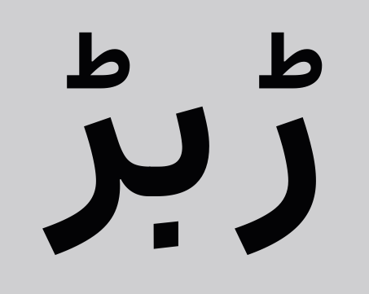
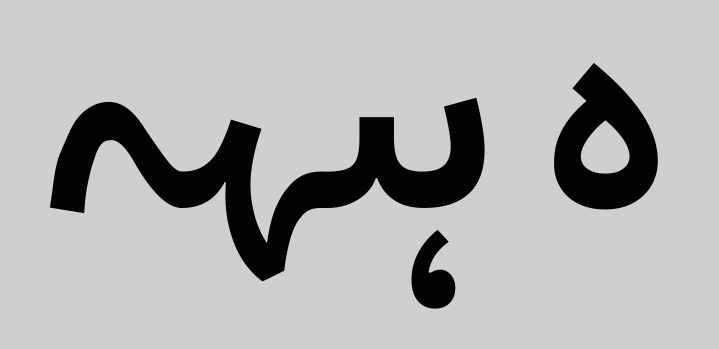
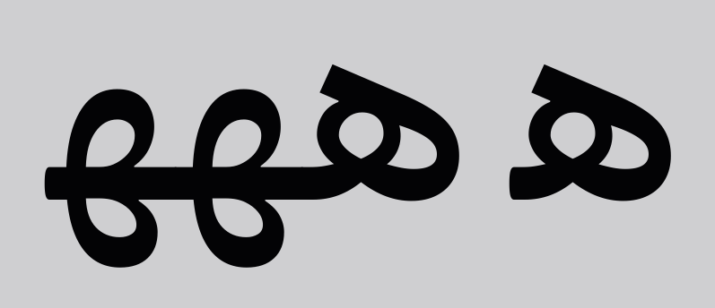
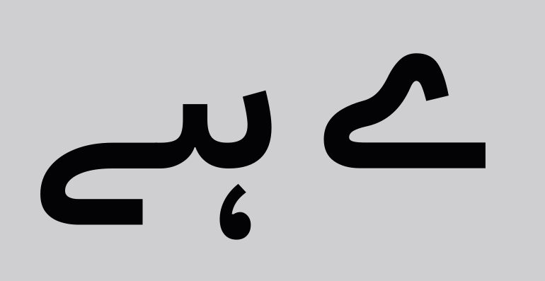
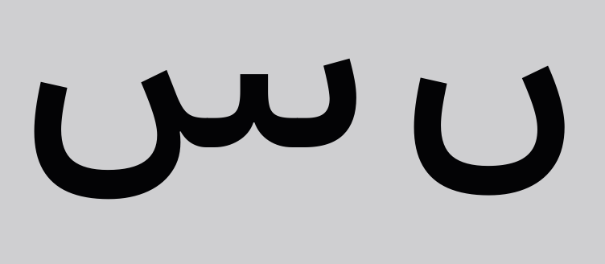
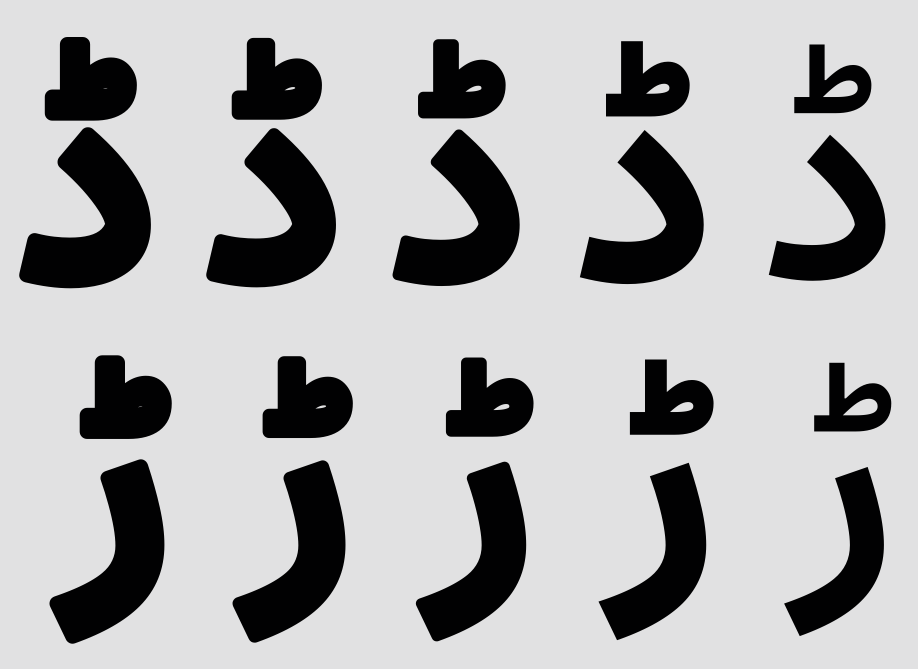

# Estedad-Urdu

This fork is an Urdu-compatible modification of [Estedad-MDarvishi](https://github.com/MohamadDarvishi/Estedad-MDarvishi).

I modified this font for my personal use on [my website](https://src4026.gitlab.io) for some of the textual matter in Urdu.

Due to personal stylistic and convenience as well as my lack of experience, knowledge, resources, and good practice, I have only kept the dot-style 4 from the original font and the semibold, along with some additional darker variants as I found suitable.

## Modifications

I will admit that I have not etched a single stroke, all the basic characters of the modifications were already there; I simply mixed and matched them for some characters and mapped others.

### Urdu/Persian Numerals

  

### Urdu Retroflex Characters

  
  
  

### Gol He

  

### Do Chasmi He

  

### Barri Yeh

  

### Noon Ghunna

  

## Weights

  

